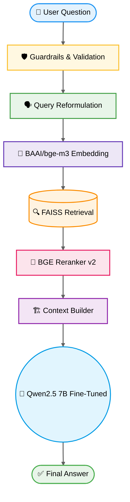

# 🚀 [Tips Hindawi](https://www.tipshindawi.com/) Challenge (June–July) 2026

> 🏆 This repository is my official submission for the [ **Tips Hindawi** ](https://www.tipshindawi.com/) **Challenge (June–July) 2026**.

## 👤 Participant

| Field            | Value                                |
| ---------------- | ------------------------------------ |
| Full Name        | Kareem Aboalnoor Abdalaal Mohamed    |
| Project Name     | Faqeeh AI - Egyptian Legal Assistant |
| GitHub Username  | kareem-aboalnoor                     |
| Challenge Batch  | June–July 2026                       |
| Training Program | Large Language Models (LLMs) Program |
| Organization     | [**Edrak for Ai**](https://edrak4ai.com/en) |

---

# 📖 Project Overview

**Faqeeh AI** is a smart legal assistant dedicated exclusively to Egyptian law. Its primary goal is to help users understand Egyptian laws simply and easily using Artificial Intelligence.

The idea for the project stems from the fact that many people have everyday legal inquiries but struggle to understand complex legal texts or access reliable legal information quickly. Therefore, our objective was to provide a tool that helps users grasp their initial legal standing and explains laws in plain language, whether they use formal Arabic or the everyday Egyptian dialect.

⚠️ **Disclaimer:** It is important to clarify that Faqeeh AI is *not* a replacement for a professional lawyer. It is a tool designed to increase legal awareness and provide initial legal explanations. For complex cases or specialized legal opinions, consulting a qualified attorney remains strictly necessary.

---

# ✨ Features

- 🧠 **Specialized LLM Fine-Tuning**: Powered by Qwen2.5 (7B) fine-tuned specifically on Egyptian legal data to master the tone, structure, and terminology of formal legal reasoning.
- 🔍 **State-of-the-Art RAG Pipeline**: Utilizes FAISS combined with the powerful `BAAI/bge-m3` embedding model to search legal corpora with high precision.
- 🎯 **CrossEncoder Reranking**: Integrates `BAAI/bge-reranker-v2-m3` to rigorously filter and re-rank the retrieved documents, passing only the absolute most relevant top 3 legal articles to the model.
- 🛡️ **Multi-Layered Guardrails & Validation**: Implements dynamic query classification to instantly block non-legal questions (e.g., medical, sports, programming) and enforces a strict Arabic-only output validation by mathematically scanning unicode ranges.
- 🗣️ **Query Reformulation & Ambiguity Check**: Automatically translates colloquial Egyptian queries (e.g., *"صاحب الشغل طردني من غير مبرر، حقي إيه؟"*) into formal legal search terms, and checks for query ambiguity before proceeding.
- ⚡ **Streaming & Memory**: Maintains context through a custom `ConversationMemory` class and streams responses ChatGPT-style via a threaded FastAPI + ngrok backend.

---

# 🔄 System Architecture Pipeline



### 📌 Pipeline Explanation

| Stage | Description |
|-------|-------------|
| 🛡️ **Guardrails & Validation** | Detects whether the question belongs to the legal domain and blocks unrelated requests while validating the input. |
| 🗣️ **Query Reformulation** | Converts Egyptian colloquial Arabic into formal legal terminology and resolves ambiguous queries. |
| 🔢 **BAAI/bge-m3 Embedding** | Encodes the refined query into a semantic vector representation. |
| 🔍 **FAISS Retrieval** | Searches the legal knowledge base and retrieves the most relevant legal documents. |
| 🎯 **BGE Reranker v2** | Re-ranks the retrieved documents using a CrossEncoder model and keeps only the top legal evidence. |
| 🏗️ **Context Builder** | Combines the selected legal articles with conversation history to build the final prompt. |
| 🧠 **Qwen2.5-7B Fine-Tuned** | Generates a grounded legal answer using the retrieved context instead of relying solely on model memory. |
| ✅ **Final Answer** | Streams the final Arabic legal response back to the user with significantly reduced hallucinations. |

---

# 🛠️ Technologies Used

- **Core LLM**: Qwen2.5-7B (Fine-Tuned, `float16`)
- **Backend**: FastAPI, Uvicorn, PyTorch, pyngrok, Threading
- **Frontend**: Streamlit, Requests
- **RAG & Embeddings**: FAISS, `BAAI/bge-m3`
- **Reranking**: `BAAI/bge-reranker-v2-m3` (Sentence-Transformers)
- **Data Sources**: `dataflare/egypt-legal-corpus` (RAG)

### 📚 Fine-Tuning Datasets

To achieve a highly dynamic model, we merged four different datasets for the fine-tuning process:

1. `tarekys5/egyptian_legal_v2`
2. `fr3on/eg-legal-qa`
3. `fr3on/eg-legal-instruction-following`
4. `Omar-youssef/QA_LAW_Egyptian_dataset`

### Why did we use four datasets for Fine-Tuning?

Because each dataset added a unique value. One contained direct Q&A, another focused on instruction-following styles, another provided diverse legal scenarios, and another improved response quality. By merging them, the model learned various patterns of Egyptian legal reasoning instead of depending on a single source or format, resulting in a more robust assistant.

---

# ⚙️ Installation

To run this project, you need to set up both the backend (on Kaggle) and the frontend (Local).

## 1. Backend (Kaggle)

1. Obtain your free Auth Token from the [ngrok website](https://dashboard.ngrok.com/).
2. Open the notebook located at `notebooks/02_faqeeh_legal_assistant_api.ipynb` in Kaggle.
3. Paste your `ngrok` auth token in the final cell where indicated.
4. Run all cells to start the FastAPI server.
5. Wait until the notebook outputs a **Public URL** (for example: `https://xxxx.ngrok-free.app`) and copy it.

## 2. Frontend (Local Deployment)

1. Clone this repository.
2. Navigate to the `Deployment` directory.
3. Install the requirements:

```bash
pip install -r requirements.txt
```

4. Open `app.py`.
5. Replace the `API_URL` variable with the Public URL generated by ngrok and append `/ask_stream`.
6. Run the application:

```bash
streamlit run app.py
```

---

# 🚀 Usage

Once the Streamlit interface is running, simply type your legal question in either Modern Standard Arabic or Egyptian dialect.

The system automatically:

- Validates the query.
- Reformulates informal language into legal terminology.
- Retrieves the most relevant Egyptian legal articles.
- Re-ranks the retrieved evidence.
- Builds the final context.
- Generates an evidence-grounded legal response.

### Note on Fine-Tuning

If you wish to fine-tune the model again or train it on additional legal datasets, use:

```
notebooks/01_fine_tuning.ipynb
```

---

# 📸 Demo

Watch **Faqeeh AI** in action as it seamlessly answers everyday legal questions across Family Law, Labor Law, Contracts, and other legal domains while grounding every answer in retrieved Egyptian legislation.

```html
<video src="assets/demo.mp4" width="100%" controls>
  Your browser does not support the video tag.
</video>
```

---

# 📈 Results

- ✅ Successfully fine-tuned **Qwen2.5-7B** with a final training loss of **0.78**.
- 🎯 Significantly reduced hallucinations through Retrieval-Augmented Generation and CrossEncoder reranking.
- ⚖️ Generated responses grounded in actual Egyptian laws instead of relying solely on model memory.
- 🗣️ Successfully bridged Egyptian colloquial Arabic with formal legal terminology.
- ⚡ Delivered fast streaming responses with conversation memory support.

---

# 🔮 Future Improvements

- 📱 Mobile Application Development.
- 📚 Expand the legal knowledge base with the latest Egyptian laws and Court of Cassation rulings.
- 🔄 Automatic legal database updates.
- 🎙️ Egyptian Arabic voice search.
- ⚡ Faster inference and GPU optimization.
- 🌐 Deploy a scalable cloud infrastructure.

---

# 📚 About the Challenge

This project was developed as part of the **Tips Hindawi Challenge (June–July 2026).**

The challenge encourages participants to build practical AI solutions, apply Large Language Model techniques, and publish production-quality projects on GitHub.

For more information, visit:

- https://www.tipshindawi.com/
- https://edrak4ai.com/en

---

# 📄 License

This project is shared for educational, research, and portfolio purposes.
